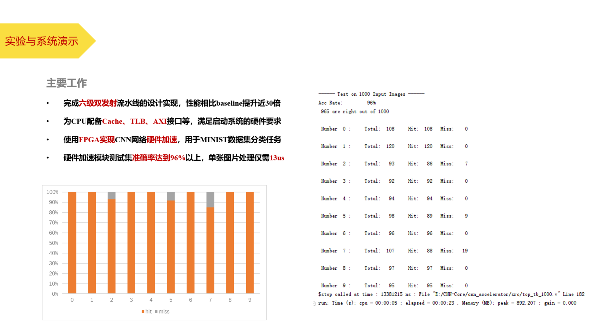

# NE-Core-CNN
This is my graduation project, using the NECore to build up a SoC with a CNN accelerator.

With the trend of developing large-scale models in the artificial intelligence field, the application deployment of AI on the device side will also face considerable hardware performance challenges in the future. In some inconvenient and cloud computing scenarios, FPGA, as a programmable logic array, can realize the hardware-level reproduction of neural networks. It has acceleration capabilities and flexibility at the same time. It is an ideal end-to-side deployment verification of AI models. plan.
This project build up a SoC composed of a high-performance MIPS processor and a neural network acceleration core laid out on an FPGA development board. Its main work includes the following aspects:

First, the design and implementation of the high-performance MIPS processor core. The instruction set implemented by this processor is a subset of MIPS32. It adopts a dual-issue six-stage pipeline design and is equipped with a Cache and TLB MMU structure. It is externally packaged as an AXI interface to meet subsequent expansion requirements.

Second, the design and implementation of the neural network acceleration kernel. This part uses hardware methods to implement modules such as convolution, pooling, activation functions, and fully connected layers. At the same time, Pytorch is used to implement the neural network to verify the feasibility and train on the MINIST dataset to provide the hardware network with the parameters required for reasoning.

The CPU part of the SoC module can pass all the functional tests and performance test programs provided by Loongson. The measured performance can reach 30 times the performance of Loongson's single-launch three-stage pipeline processor GS132, and it can meet the hardware requirements for starting the operating system. The neural network acceleration core reads the parameters in the file and the data to be processed through CPU software simulation to realize input and output verification. Under the simulation frequency of 100Mhz, its theoretical peak performance on the MINIST data set can reach 77,000 sheets per second with the accuracy beyond 96 percent.

---
Ref repo: https://github.com/RicoLi424/CNN-Digit-Recognition-Accelerated-on-FPGA